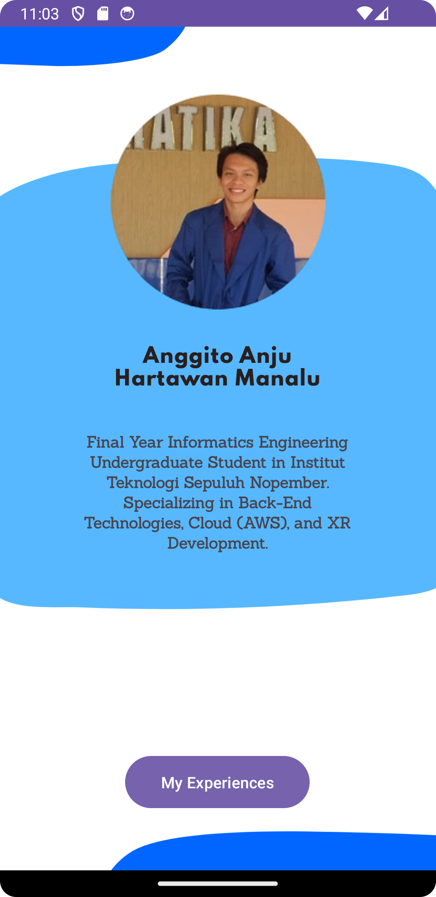
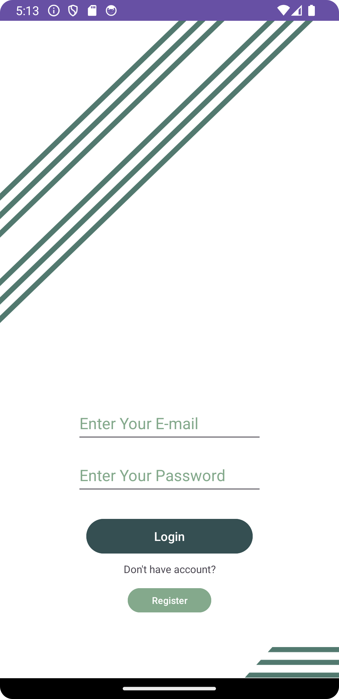

# Mobile Programming
Mobile Programming subject repository

## Submission 1 - View
- Project description: Curriculum Vitae in Android
- Project link: [Project Demo](https://youtu.be/lKz0k0OWDcs)

    

## Submission 2 - Calculator & Hitung Luas
- Project description: Calculator Android Application
- Project link: [Project Demo](https://youtu.be/d1i6trg7VVw)

    

## Submission 3 - Login using SQLite
- Project description: SQLite Implementation
- Project link: [Project Demo](https://youtu.be/d1i6trg7VVw)

    

## Submission 4 - Mini Todo List
- Project description: App-spesific storage implementation. Dialog and Listview implementation
- Project Link: [Project Demo](https://youtu.be/zYYTRWuvBPA)

    

## Submission 5 - Json Parser
- Project description: Using HttpURLConnection to fetch a Json data from the internet
- Project Link: [Project Demo](https://youtu.be/yXZP7q9TN0U)

    

## Submission 6 - Simple Image Upload Application
- Project description: Using HttpURLConnection to upload to the backend and implements content resolver to save images
- Project Link: [Project Demo](https://youtu.be/0ANn01Z90X0)

    

