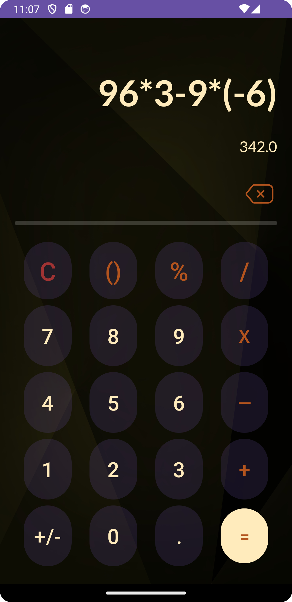

# Mobile Programming
Mobile Programming subject repository

## Submission 1 - View
- Project description: Curriculum Vitae in Android
- Project link: [Project Demo](https://youtu.be/lKz0k0OWDcs)

    

## Submission 2 - Calculator & Hitung Luas
- Project description: Calculator Android Application
- Project link: [Project Demo](https://youtu.be/d1i6trg7VVw)

    

## Submission 3 - Login using SQLite
- Project description: SQLite Implementation
- Project link: [Project Demo](https://youtu.be/d1i6trg7VVw)

    

